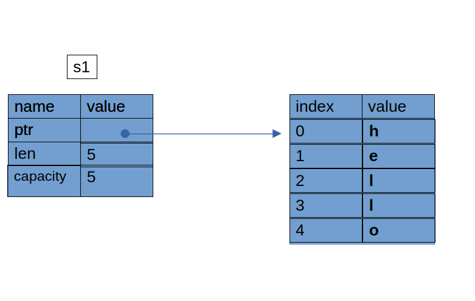

## Chapter 4 Understanding Ownership

Rust uses a third approach: memory is managed through a system of ownership
with a set of rules that the compiler checks. If any of the rules are violated,
the program won’t compile. None of the features of ownership will slow down
your program while it’s running.

The stack is a region of memory that operates in a last-in, first-out (LIFO)
manner. It is used for storing local variables, function parameters, and return
addresses. When a function is called, its local variables and parameters are
pushed onto the stack. When the function returns, the stack is unwound, and
these variables are popped off.

The heap is a region of memory used for dynamic memory allocation. Unlike the
stack, the heap does not have a fixed size and can grow and shrink as needed.
Memory on the heap is managed through pointers and references.

### Ownership rules

- Each value in Rust has an owner
- There can only be one at time.
- When the owner goes out of scope, the value will be dropped

### Variable scope

The following listing demonstrates points about variable scopes:

    { // s is not valid here, since it's not yet declared
        let s = "hello"; // s is valid from this point forward

        // do stuff with s
    } // s's scope is now invalid

### String literals

Rust will never automatically make deep copies of your data.

The String type can be mutated. The memory allocated to store the String comes
from the heap. Consider the listing: 

    {
        let s = String::from("hello"); // The variable s is valid from this point on.
        // Do stuff with variable s.

    } // The scope of all varibales in the enclosing braces is now over,  and the
      // variable s is no longer valid.

The memory allocation is shown in the following figure.

When the variable `s` goes out of scope, Rust calls a special function `drop`
that returns the memory allocated by `s`. Rust calls `drop` automatically at
the point of the closing brace. (Not sure if `drop` is a method of `s` or
function.)

___
**Note: Resource Acquisition Is Initialization (RAII) is a core programming
technique, primarily used in C++ and other languages like Rust and Ada, that
automatically manages system resources by tying their lifecycles to the
lifetime of objects. The core principle ensures that a resource is acquired
when an object is created (initialized) and automatically released when the
object is destroyed (goes out of scope)** 
___

### Variables and Data Interacting with Move

Consider the following listing.

    {
        let s1 = String::from("hello"); // The variable s1 is valid from this point on.
        println!("s1 = {s1}");

        let s2 = s1; // s2 now takes ownership of s1 data, and s1 is now invalid.
        // Any attempt to now use s1 will result in compile error. One must 

        println!("s2 = {s2}");
    }

The below figure depicts the memory representation for a move in the above listing.

When we assign variable `s1` to `s2`, the String data&mdash;the pointer, the
length, and the capacity&mdash;which all are on the stack, are copied. We do
not copy the data on the heap that the pointer refers to. After the assignment
`s1` is no longer valid, and any use of `s1` gives an error. We say `s1` was
moved into `s2`. 

This behavior implies a design choice: Rust will never automatically (by default)
create deep copies of your data. **Any default variable assignment is a move.**

### Variables and Data Interacting with Clone 

Use clone to deeply copy a variable.

Can't copy a variable with Drop implementation

In general, only simple types that do not require allocation can be copied.

### Return Values and Scope

