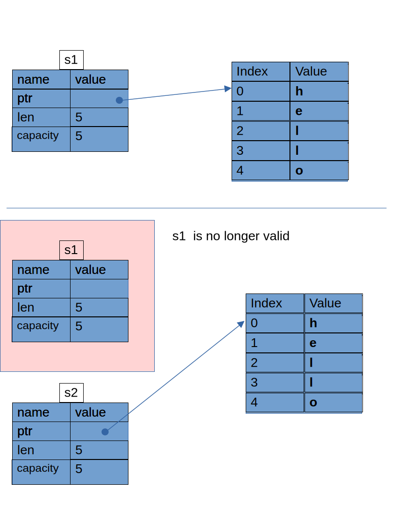

## Chapter 4 Understanding Ownership

Rust uses a third approach: memory is managed through a system of ownership
with a set of rules that the compiler checks. If any of the rules are violated,
the program won’t compile. None of the features of ownership will slow down
your program while it’s running.

The stack is a region of memory that operates in a last-in, first-out (LIFO)
manner. It is used for storing local variables, function parameters, and return
addresses. When a function is called, its local variables and parameters are
pushed onto the stack. When the function returns, the stack is unwound, and
these variables are popped off.

The heap is a region of memory used for dynamic memory allocation. Unlike the
stack, the heap does not have a fixed size and can grow and shrink as needed.
Memory on the heap is managed through pointers and references.

### Ownership rules

- Each value in Rust has an owner
- There can only be one at time.
- When the owner goes out of scope, the value will be dropped

#### Variable scope

##### Block scoping
The following listing demonstrates points about block variable scoping:

    { // s is not valid here, since it's not yet declared
        let s = "hello"; // s is valid from this point forward

        // do stuff with s
    } // s's scope is now invalid

##### Non-Lexical Lifetimes
Non-lexical Lifetimes (NLL) were introduced to Rust in 2018,
The following listing demonstrates points about NLL:

    fn main () {
        let mut x = 1;
        let r = &x; // Immutable borrow of x.
        println!("r: {}",r); // r is last used here
        x = 2; // x can be mutated here; Under the old
               // lexical scoping rules, this statement would
               // cause a compile-time error.
        println!("x: {}",x);
    }

The above example would have failed under the old lexical scoping rules.

#### String literals

Rust will never automatically make deep copies of your data.

The String type can be mutated. The memory allocated to store the String comes
from the heap. Consider the listing: 

    {
        let s = String::from("hello"); // The variable s is valid from this point on.
        // Do stuff with variable s.

    } // The scope of all varibales in the enclosing braces is now over,  and the
      // variable s is no longer valid.

The memory allocation is shown in the following figure.

When the variable `s` goes out of scope, Rust calls a special function `drop`
that returns the memory allocated by `s`. Rust calls `drop` automatically at
the point of the closing brace. (Not sure if `drop` is a method of `s` or
function.)

___
**Note: Resource Acquisition Is Initialization (RAII) is a core programming
technique, primarily used in C++ and other languages like Rust and Ada, that
automatically manages system resources by tying their lifecycles to the
lifetime of objects. The core principle ensures that a resource is acquired
when an object is created (initialized) and automatically released when the
object is destroyed (goes out of scope)** 
___

#### Variables and Data Interacting with Move

Consider the following listing.

    {
        let s1 = String::from("hello"); // The variable s1 is valid from this point on.
        println!("s1 = {s1}");

        let s2 = s1; // s2 now takes ownership of s1 data, and s1 is now invalid.
        // Any attempt to now use s1 will result in compile error. One must 

        println!("s2 = {s2}");
    }

The below figure depicts the memory representation for a move in the above listing.

When we assign variable `s1` to `s2`, the String data&mdash;the pointer, the
length, and the capacity&mdash;which all are on the stack, are copied. We do
not copy the data on the heap that the pointer refers to. After the assignment
`s1` is no longer valid, and any use of `s1` gives an error. We say `s1` was
moved into `s2`. 

This behavior implies a design choice: Rust will never automatically (by default)
create deep copies of your data. **Any default variable assignment is a move.**

#### Variables and Data Interacting with Clone 

Use clone method to deeply copy a variable.

    let s1 = String::from("hello");
    let s2 = s1.clone();
    println!("s1 = {s1}, s2 = {s2}");
   

#### Stack-Only Data: Copy

Consider the following listing:

    let x = 5;
    let y = x;
    println!("x = {x}, y = {y}");

The above listing is valid code - x is still a valid variable!

In general, primitive data types that are known at compile time are generally
placed on the stack. The integer variable x is a known size and hence it's
stored on the stack,and it's lifetime ends when the function is returned or
goes out of scope.
 
Rust has a special annotation called the `Copy` trait. 

The Rust Copy trait is a marker trait that changes a type's default behavior
from move semantics to copy semantics. When a type implements Copy, an
assignment (=) or function passing results in an implicit bit-wise copy of the
value, leaving the original variable usable. 

**Key Characteristics**

-Implicit Duplication: Copies happen automatically, for example, during
variable assignment (let y = x;) or when passing arguments to a function.

- Bit-wise Copy: The duplication is always a simple memory copy of the
value's bits. You cannot overload this behavior.

- Marker Trait: The Copy trait itself has no methods. Clone as a Supertrait:
Any type that implements Copy must also implement the Clone trait. The Clone
implementation for a Copy type is typically trivial (*self). Clone, unlike
Copy, is an explicit operation (x.clone()) and can run arbitrary code (e.g.,
allocating new heap memory for a String).

- Rust won’t let us annotate a type with Copy if the type, or any of its parts,
has implemented the Drop trait. A type cannot implement Copy if it manages
resources beyond its own size in memory (e.g., heap-allocated data or network
connections). Implementing Copy for such types would lead to potential memory
errors, such as a double free.

What types implement the `Copy` trait.

- All the integer types, such as u32. 

- The Boolean type, bool, with values true and false. 

- All the floating-point types, such as f64. 

- The character type, char. 

- Tuples, if they only contain types that also implement Copy. For example,
(i32, i32) implements Copy, but (i32, String) does not.

### Ownership and Functions

The mechanics of passing a value to a function are similar to those when
assigning a value to a variable. 

** Passing a variable to a function will move or copy, just as assignment does. ** 

### Return Values and Scope

Returning values can also transfer ownership. The ownership of a variable
follows the same pattern every time: assigning a value to another variable
moves it. When a variable that includes data on the heap goes out of scope, the
value will be cleaned up by `drop` unless ownership of the data has been moved to
another variable.

Rust does let us return multiple values using a tuple.

### References and Borrowing

A reference is like a pointer in that it’s an address we can follow to access
the data stored at that address; that data is owned by some other variable.
Unlike a pointer, a reference is guaranteed to point to a valid value of a
particular type for the life of that reference.

#### Mutable References

Mutable references have one big restriction: if you have a mutable reference to
a value, you can have no other references to that value. Code that attempts
to create two mutable references to s will fail!

We also can't have a mutable reference while we have an immutable reference to
the same value.

#### Dangling References

Rust's compiler guarantees that references will never dangle.

### The Slice Type

(Continue here)

